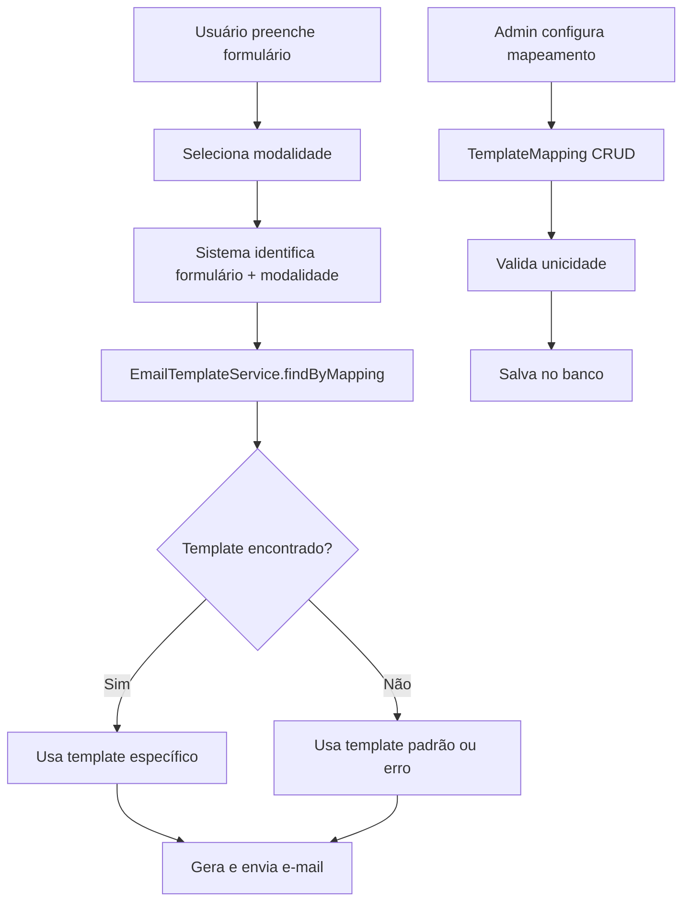

# Design Document - Email Template Mapping

## Overview

O sistema de mapeamento de templates de e-mail permitirá vincular automaticamente templates específicos baseados na combinação de formulário e modalidade selecionados pelo usuário. A solução será implementada como uma extensão do sistema atual de templates, adicionando uma camada de lógica de mapeamento que identifica qual template usar durante o processo de envio de e-mail.

## Architecture

### Current State Analysis

O sistema atual já possui:
- Tabela `email_templates` com campos `formulario` e `modalidade`
- Interface de criação de templates (`FormularioNovoTemplate.tsx`)
- Dois formulários principais: Comply Fiscal e Comply e-DOCS
- Modalidades: `on-premise` e `saas` (definidas em `formOptions.ts`)

### Proposed Architecture



## Components and Interfaces

### 1. Database Schema Enhancement

A tabela `email_templates` já possui os campos necessários:
- `formulario`: 'comply_edocs' | 'comply_fiscal' | null
- `modalidade`: string | null

Será necessário adicionar um índice composto para otimizar consultas:

```sql
CREATE INDEX IF NOT EXISTS idx_email_templates_mapping 
ON public.email_templates(formulario, modalidade) 
WHERE ativo = true;
```

### 2. TypeScript Interfaces

```typescript
// Extensão do tipo existente EmailTemplate
interface EmailTemplateMapping {
  formulario: 'comply_edocs' | 'comply_fiscal';
  modalidade: 'on-premise' | 'saas';
  templateId: string;
}

interface TemplateMappingService {
  findTemplateByMapping(formulario: string, modalidade: string): Promise<EmailTemplate | null>;
  validateMappingUniqueness(formulario: string, modalidade: string, excludeId?: string): Promise<boolean>;
  getMappingsList(): Promise<EmailTemplateMapping[]>;
}
```

### 3. Core Components

#### EmailTemplateService Enhancement
- Método `findByMapping(formulario, modalidade)` para buscar template específico
- Método `validateUniqueness()` para evitar duplicação de mapeamentos
- Fallback para template padrão quando não há mapeamento específico

#### Admin Interface Components
- `TemplateMappingList`: Lista todos os mapeamentos existentes
- `TemplateMappingForm`: Formulário para criar/editar mapeamentos
- `MappingValidation`: Componente para validar unicidade

#### Form Integration
- Modificação nos formulários para usar o serviço de mapeamento
- Hook `useEmailTemplateMapping` para integração com formulários

## Data Models

### EmailTemplate (Existing - Enhanced)
```typescript
interface EmailTemplate {
  id: string;
  nome: string;
  assunto: string;
  corpo: string;
  descricao?: string | null;
  tipo?: string | null;
  ativo: boolean;
  vinculado_formulario: boolean;
  formulario?: 'comply_edocs' | 'comply_fiscal' | null;
  modalidade?: string | null;
  created_at?: string;
  updated_at?: string;
}
```

### TemplateMappingResult
```typescript
interface TemplateMappingResult {
  template: EmailTemplate | null;
  isDefault: boolean;
  mappingFound: boolean;
}
```

## Error Handling

### Validation Errors
- **Duplicate Mapping**: Quando já existe um template para a mesma combinação formulário + modalidade
- **Invalid Form/Modality**: Quando formulário ou modalidade não são válidos
- **Template Not Found**: Quando template referenciado não existe

### Runtime Errors
- **No Template Found**: Quando não há template específico nem padrão
- **Database Connection**: Falhas na consulta ao banco
- **Template Rendering**: Erros na geração do e-mail

### Error Handling Strategy
```typescript
class EmailTemplateError extends Error {
  constructor(
    message: string,
    public code: 'DUPLICATE_MAPPING' | 'TEMPLATE_NOT_FOUND' | 'INVALID_MAPPING',
    public details?: any
  ) {
    super(message);
  }
}
```

## Testing Strategy

### Unit Tests
1. **EmailTemplateService**
   - `findByMapping()` retorna template correto
   - `findByMapping()` retorna null quando não encontra
   - `validateUniqueness()` detecta duplicações
   - Fallback para template padrão funciona

2. **Validation Logic**
   - Combinações válidas de formulário + modalidade
   - Rejeição de combinações inválidas
   - Unicidade de mapeamentos

### Integration Tests
1. **Database Operations**
   - Consultas por mapeamento funcionam corretamente
   - Índices são utilizados adequadamente
   - Transações mantêm consistência

2. **Form Integration**
   - Formulários identificam template correto
   - E-mails são gerados com template apropriado
   - Fallback funciona quando necessário

### End-to-End Tests
1. **Complete Flow**
   - Usuário preenche formulário → template correto é usado
   - Admin cria mapeamento → mapeamento funciona imediatamente
   - Cenários de erro são tratados adequadamente

### Test Data Setup
```typescript
const testMappings = [
  { formulario: 'comply_fiscal', modalidade: 'on-premise', templateId: 'template-1' },
  { formulario: 'comply_fiscal', modalidade: 'saas', templateId: 'template-2' },
  { formulario: 'comply_edocs', modalidade: 'on-premise', templateId: 'template-3' },
  { formulario: 'comply_edocs', modalidade: 'saas', templateId: 'template-4' }
];
```

## Implementation Considerations

### Performance
- Índice composto em (formulario, modalidade) para consultas rápidas
- Cache de mapeamentos em memória para reduzir consultas ao banco
- Lazy loading de templates não utilizados

### Scalability
- Estrutura permite adicionar novos formulários facilmente
- Modalidades podem ser expandidas sem mudanças na arquitetura
- Sistema de fallback garante funcionamento mesmo com configurações incompletas

### Backwards Compatibility
- Templates existentes continuam funcionando
- Sistema funciona mesmo sem mapeamentos específicos
- Migração gradual dos templates existentes

### Security
- Validação de entrada para prevenir injection
- Verificação de permissões para operações de admin
- Auditoria de mudanças nos mapeamentos

## Migration Strategy

### Phase 1: Infrastructure
- Criar índices necessários
- Implementar serviços base
- Testes unitários

### Phase 2: Admin Interface
- Interface de gerenciamento de mapeamentos
- Validações e feedback de erro
- Testes de integração

### Phase 3: Form Integration
- Integração com formulários existentes
- Sistema de fallback
- Testes end-to-end

### Phase 4: Optimization
- Cache de mapeamentos
- Monitoramento de performance
- Documentação final