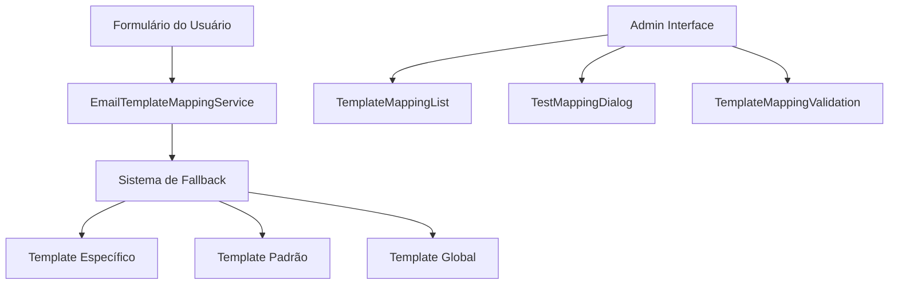

# Email Template Mapping - Guia do Desenvolvedor

## Visão Geral

O sistema de mapeamento de templates de e-mail permite vincular automaticamente templates específicos baseados na combinação de formulário e modalidade selecionados pelo usuário. Esta documentação fornece informações técnicas completas sobre como usar e integrar o sistema.

## Arquitetura

### Componentes Principais



### Fluxo de Dados

1. **Identificação**: Sistema identifica formulário e modalidade
2. **Busca Específica**: Procura template específico para a combinação
3. **Sistema de Fallback**: Se não encontrar, usa hierarquia de fallback
4. **Aplicação**: Template é aplicado ao e-mail

## API Principal

### EmailTemplateMappingService

O serviço principal para gerenciar mapeamentos de templates.

```typescript
import { emailTemplateMappingService } from '@/services/emailTemplateMappingService';
```

#### Métodos Principais

##### `findByMapping(formulario, modalidade)`

Busca um template específico para a combinação formulário + modalidade.

**Parâmetros:**
- `formulario`: `'comply_edocs' | 'comply_fiscal'`
- `modalidade`: `'on-premise' | 'saas'`

**Retorno:** `Promise<EmailTemplate | null>`

**Exemplo:**
```typescript
const template = await emailTemplateMappingService.findByMapping(
  'comply_fiscal',
  'on-premise'
);

if (template) {
  console.log(`Template encontrado: ${template.nome}`);
} else {
  console.log('Nenhum template específico encontrado');
}
```

##### `findWithFallback(formulario, modalidade)`

Busca template com sistema de fallback completo.

**Parâmetros:**
- `formulario`: `'comply_edocs' | 'comply_fiscal'`
- `modalidade`: `'on-premise' | 'saas'`

**Retorno:** `Promise<TemplateMappingResult>`

**Exemplo:**
```typescript
const result = await emailTemplateMappingService.findWithFallback(
  'comply_edocs',
  'saas'
);

console.log('Template:', result.template?.nome);
console.log('É padrão:', result.isDefault);
console.log('Mapeamento encontrado:', result.mappingFound);
console.log('Tipo de fallback:', result.fallbackType);
```

##### `validateUniqueness(formulario, modalidade, excludeId?)`

Valida se uma combinação formulário + modalidade é única.

**Parâmetros:**
- `formulario`: `'comply_edocs' | 'comply_fiscal'`
- `modalidade`: `'on-premise' | 'saas'`
- `excludeId`: `string` (opcional) - ID do template a excluir da validação

**Retorno:** `Promise<boolean>`

**Exemplo:**
```typescript
const isUnique = await emailTemplateMappingService.validateUniqueness(
  'comply_fiscal',
  'saas',
  'template-id-to-exclude'
);

if (!isUnique) {
  console.error('Já existe um template para esta combinação');
}
```

##### `getMappingsList()`

Retorna lista de todos os mapeamentos ativos.

**Retorno:** `Promise<EmailTemplateMapping[]>`

**Exemplo:**
```typescript
const mappings = await emailTemplateMappingService.getMappingsList();

mappings.forEach(mapping => {
  console.log(`${mapping.formulario} + ${mapping.modalidade} → ${mapping.template?.nome}`);
});
```

### Hook useEmailTemplateMapping

Hook React para integração com componentes.

```typescript
import { useEmailTemplateMapping } from '@/hooks/useEmailTemplateMapping';
```

**Exemplo de uso:**
```typescript
function MyComponent() {
  const { 
    findByMapping, 
    findWithFallback, 
    validateUniqueness,
    getMappingsList,
    loading,
    error 
  } = useEmailTemplateMapping();

  const handleFormSubmit = async (formulario, modalidade) => {
    const result = await findWithFallback(formulario, modalidade);
    
    if (result.template) {
      // Usar template encontrado
      console.log('Usando template:', result.template.nome);
    } else {
      // Tratar caso sem template
      console.error('Nenhum template disponível');
    }
  };

  return (
    <div>
      {loading && <p>Carregando...</p>}
      {error && <p>Erro: {error}</p>}
      {/* Resto do componente */}
    </div>
  );
}
```

## Sistema de Fallback

O sistema de fallback segue uma hierarquia específica quando não encontra um template específico:

### Hierarquia de Fallback

1. **Template Específico**: Combinação exata de formulário + modalidade
2. **Template Padrão Configurado**: Template configurado como padrão para o formulário
3. **Template Padrão do Formulário**: Template com modalidade `null` para o formulário
4. **Qualquer Template Ativo**: Qualquer template ativo do formulário (se configurado)
5. **Template Global de Fallback**: Template configurado como fallback global
6. **Nenhum Template**: Retorna `null` ou erro (dependendo da configuração)

### Configuração do Sistema de Fallback

```typescript
import { emailTemplateFallbackConfigManager } from '@/config/emailTemplateConfig';

// Configurar template padrão para um formulário
emailTemplateFallbackConfigManager.setDefaultTemplate('comply_fiscal', 'template-id');

// Configurar template global de fallback
emailTemplateFallbackConfigManager.setGlobalFallbackTemplate('global-template-id');

// Habilitar uso de qualquer template ativo como fallback
emailTemplateFallbackConfigManager.updateConfig({
  useAnyActiveTemplateAsFallback: true
});

// Configurar para falhar quando não encontrar template
emailTemplateFallbackConfigManager.updateConfig({
  failWhenNoTemplateFound: true
});
```

## Validação de Mapeamentos

### Hook useTemplateMappingValidation

Hook para validação em tempo real de mapeamentos.

```typescript
import { useTemplateMappingValidation } from '@/hooks/useTemplateMappingValidation';
```

**Exemplo:**
```typescript
function TemplateForm() {
  const {
    validateMapping,
    validateCombination,
    validationState,
    isValidating,
    hasError,
    errorMessage
  } = useTemplateMappingValidation({
    showToasts: true,
    autoValidate: true,
    validationDelay: 500
  });

  const handleValidation = async () => {
    const result = await validateMapping({
      formulario: 'comply_fiscal',
      modalidade: 'on-premise',
      templateId: 'new-template-id'
    });

    if (result.isValid) {
      console.log('Mapeamento válido');
    } else {
      console.error('Erro:', result.error);
    }
  };

  return (
    <div>
      {isValidating && <p>Validando...</p>}
      {hasError && <p className="error">{errorMessage}</p>}
      <button onClick={handleValidation}>Validar</button>
    </div>
  );
}
```

### Utilitários de Validação

```typescript
import { 
  validateMappingUniqueness,
  validateMappingCombination 
} from '@/utils/templateMappingValidation';

// Validar combinação localmente
const combinationResult = validateMappingCombination('comply_fiscal', 'on-premise');

// Validar unicidade no banco
const uniquenessResult = await validateMappingUniqueness({
  formulario: 'comply_fiscal',
  modalidade: 'on-premise',
  templateId: 'template-id'
});
```

## Componentes de Interface

### TemplateMappingList

Componente para listar e gerenciar mapeamentos.

```typescript
import TemplateMappingList from '@/components/admin/email/TemplateMappingList';

function AdminPanel() {
  return (
    <TemplateMappingList
      autoRefresh={true}
      refreshInterval={30000}
      className="my-custom-class"
    />
  );
}
```

### TestMappingDialog

Componente para testar mapeamentos.

```typescript
import TestMappingDialog from '@/components/admin/email/TestMappingDialog';

function TestInterface() {
  const [dialogOpen, setDialogOpen] = useState(false);
  const [selectedMapping, setSelectedMapping] = useState(null);

  return (
    <TestMappingDialog
      open={dialogOpen}
      onOpenChange={setDialogOpen}
      mapping={selectedMapping}
      defaultAdminEmail="admin@empresa.com"
    />
  );
}
```

## Tratamento de Erros

### Tipos de Erro

O sistema define tipos específicos de erro através da classe `EmailTemplateError`:

```typescript
import { EmailTemplateError } from '@/errors/EmailTemplateError';

// Tipos de erro disponíveis:
// - DUPLICATE_MAPPING: Mapeamento duplicado
// - TEMPLATE_NOT_FOUND: Template não encontrado
// - INVALID_MAPPING: Mapeamento inválido
// - DATABASE_ERROR: Erro de banco de dados
// - VALIDATION_ERROR: Erro de validação
// - SYSTEM_ERROR: Erro do sistema
```

### Tratamento de Erros

```typescript
try {
  const template = await emailTemplateMappingService.findByMapping(
    'comply_fiscal',
    'on-premise'
  );
} catch (error) {
  if (error instanceof EmailTemplateError) {
    switch (error.code) {
      case 'DATABASE_ERROR':
        console.error('Erro de banco:', error.message);
        break;
      case 'TEMPLATE_NOT_FOUND':
        console.error('Template não encontrado:', error.message);
        break;
      default:
        console.error('Erro desconhecido:', error.message);
    }
  } else {
    console.error('Erro inesperado:', error);
  }
}
```

## Logs e Auditoria

### Sistema de Logs

O sistema inclui logs detalhados para auditoria e debugging:

```typescript
import { auditLogger } from '@/services/auditLogger';

// Logs são gerados automaticamente, mas você pode adicionar logs customizados:
await auditLogger.logOperation(
  'custom_operation',
  'mapping',
  { customData: 'value' },
  'success'
);
```

### Configuração de Logs

```typescript
import { emailTemplateFallbackConfigManager } from '@/config/emailTemplateConfig';

// Habilitar/desabilitar logs
emailTemplateFallbackConfigManager.updateConfig({
  enableLogging: true,
  logFallbackUsage: true,
  logMappingNotFound: true
});
```

## Integração com Formulários

### Integração Básica

```typescript
// Em um componente de formulário
import { useEmailTemplateMapping } from '@/hooks/useEmailTemplateMapping';

function FormularioComply() {
  const { findWithFallback } = useEmailTemplateMapping();
  
  const handleSubmit = async (formData) => {
    // Identificar formulário e modalidade
    const formulario = 'comply_fiscal'; // ou 'comply_edocs'
    const modalidade = formData.modalidade; // 'on-premise' ou 'saas'
    
    // Buscar template apropriado
    const result = await findWithFallback(formulario, modalidade);
    
    if (result.template) {
      // Usar template para gerar e-mail
      await sendEmailWithTemplate(result.template, formData);
      
      // Log se foi usado fallback
      if (result.isDefault) {
        console.warn(`Fallback usado: ${result.fallbackType}`);
      }
    } else {
      // Tratar caso sem template
      throw new Error('Nenhum template disponível para esta combinação');
    }
  };
  
  return (
    // JSX do formulário
  );
}
```

### Identificação Automática

```typescript
// Utilitário para identificar formulário automaticamente
function identifyFormulario(pathname: string): 'comply_edocs' | 'comply_fiscal' | null {
  if (pathname.includes('comply-edocs')) return 'comply_edocs';
  if (pathname.includes('comply-fiscal')) return 'comply_fiscal';
  return null;
}

// Uso no componente
const formulario = identifyFormulario(window.location.pathname);
```

## Performance e Otimização

### Índices de Banco de Dados

O sistema utiliza índices otimizados para consultas rápidas:

```sql
-- Índice principal para consultas de mapeamento
CREATE INDEX IF NOT EXISTS idx_email_templates_mapping 
ON public.email_templates(formulario, modalidade) 
WHERE ativo = true;

-- Índice para consultas por formulário
CREATE INDEX IF NOT EXISTS idx_email_templates_formulario 
ON public.email_templates(formulario) 
WHERE ativo = true AND vinculado_formulario = true;
```

### Cache e Otimizações

```typescript
// O sistema inclui cache automático, mas você pode configurar:
emailTemplateFallbackConfigManager.updateConfig({
  cacheEnabled: true,
  cacheTTL: 300000 // 5 minutos
});
```

## Testes

### Testes Unitários

```typescript
import { emailTemplateMappingService } from '@/services/emailTemplateMappingService';

describe('EmailTemplateMappingService', () => {
  test('deve encontrar template específico', async () => {
    const template = await emailTemplateMappingService.findByMapping(
      'comply_fiscal',
      'on-premise'
    );
    
    expect(template).toBeTruthy();
    expect(template?.formulario).toBe('comply_fiscal');
    expect(template?.modalidade).toBe('on-premise');
  });
  
  test('deve usar fallback quando não encontra específico', async () => {
    const result = await emailTemplateMappingService.findWithFallback(
      'comply_edocs',
      'saas'
    );
    
    expect(result.template).toBeTruthy();
    if (!result.mappingFound) {
      expect(result.isDefault).toBe(true);
      expect(result.fallbackType).toBeDefined();
    }
  });
});
```

### Testes de Integração

```typescript
import { render, screen, waitFor } from '@testing-library/react';
import TemplateMappingList from '@/components/admin/email/TemplateMappingList';

test('deve carregar e exibir mapeamentos', async () => {
  render(<TemplateMappingList />);
  
  await waitFor(() => {
    expect(screen.getByText('Mapeamentos de Templates')).toBeInTheDocument();
  });
  
  // Verificar se os mapeamentos são carregados
  await waitFor(() => {
    expect(screen.getByText('Comply Fiscal')).toBeInTheDocument();
  });
});
```

## Migração e Compatibilidade

### Migração de Templates Existentes

```typescript
// Script de migração para templates existentes
async function migrateExistingTemplates() {
  const templates = await getAllTemplates();
  
  for (const template of templates) {
    if (template.formulario && template.modalidade) {
      // Template já tem mapeamento
      continue;
    }
    
    // Aplicar lógica de migração baseada no nome ou outros critérios
    if (template.nome.includes('Fiscal')) {
      await updateTemplate(template.id, {
        formulario: 'comply_fiscal',
        modalidade: 'on-premise' // ou lógica específica
      });
    }
  }
}
```

### Compatibilidade com Versões Anteriores

O sistema mantém compatibilidade com templates existentes:

- Templates sem `formulario` e `modalidade` continuam funcionando
- Sistema de fallback garante que sempre há um template disponível
- Migração pode ser feita gradualmente

## Monitoramento e Debugging

### Logs de Debug

```typescript
// Habilitar logs detalhados para debugging
emailTemplateFallbackConfigManager.updateConfig({
  enableLogging: true,
  logLevel: 'debug'
});

// Logs aparecerão no console:
// [EmailTemplateMapping] Buscando template para formulário: comply_fiscal, modalidade: on-premise
// [EmailTemplateMapping] Template encontrado: Template Fiscal On-Premise (ID: abc123)
```

### Métricas e Monitoramento

```typescript
// O sistema registra métricas automaticamente via auditLogger
// Você pode consultar logs de auditoria para:
// - Frequência de uso de fallback
// - Templates mais utilizados
// - Erros de mapeamento
// - Performance das consultas
```

## Configuração Avançada

### Configuração Completa do Sistema

```typescript
import { emailTemplateFallbackConfigManager } from '@/config/emailTemplateConfig';

// Configuração completa
emailTemplateFallbackConfigManager.updateConfig({
  // Templates padrão por formulário
  defaultTemplates: {
    comply_fiscal: 'template-fiscal-default',
    comply_edocs: 'template-edocs-default'
  },
  
  // Template global de fallback
  globalFallbackTemplate: 'template-global-fallback',
  
  // Comportamentos
  useAnyActiveTemplateAsFallback: true,
  failWhenNoTemplateFound: false,
  
  // Logs
  enableLogging: true,
  logFallbackUsage: true,
  logMappingNotFound: true,
  
  // Cache
  cacheEnabled: true,
  cacheTTL: 300000
});
```

## Próximos Passos

Para implementar o sistema em seu projeto:

1. **Configuração Inicial**: Configure os templates padrão e fallback
2. **Integração**: Integre com seus formulários existentes
3. **Testes**: Execute os testes para verificar funcionamento
4. **Monitoramento**: Configure logs e monitoramento
5. **Otimização**: Ajuste configurações baseado no uso real

## Suporte

Para dúvidas ou problemas:

1. Consulte os logs de auditoria para debugging
2. Verifique a configuração do sistema de fallback
3. Execute os testes de integração
4. Consulte os exemplos de código nesta documentação